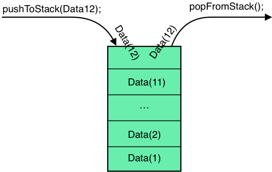

# Stack 

Stack is a structure that can collect elements with two operations:
1. push - which adds element to the collection
2. pop - which removes the most recently added element

Stack is one of singly linked list.

