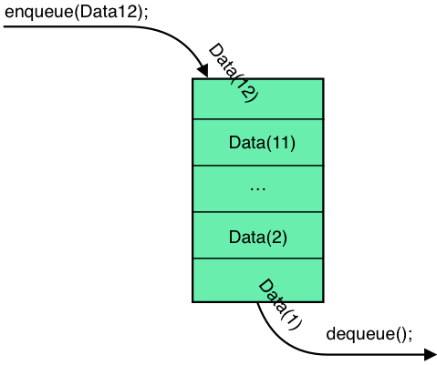

# Queue 

A queue is a structure that can collect elements with two operations:
1. Enqueue - which adds an element to the collection at the end of the list. 
2. Dequeue - which removes the most firstly added element.

Queue is one of singly linked list.

